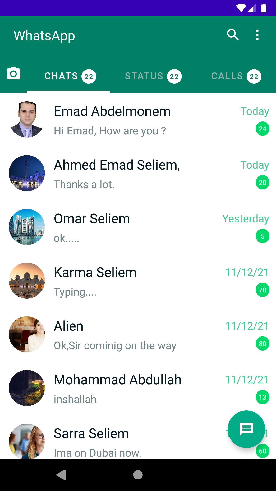
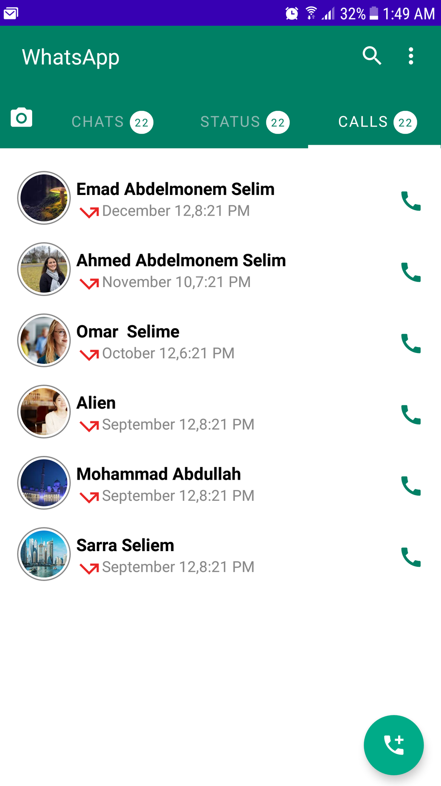

# android-jetpackCompose-whatsapp-ui

Jetpack Compose is Android’s modern toolkit for building native UI. It simplifies and accelerates UI development on Android. Quickly bring your app to life with less code, powerful tools, and intuitive Kotlin APIs.
==============================================
# Whats app UI

Using Jetpack compose I built whats app UI ,on this app you can learn how to use 

 *TopAppBr(Adding text , iocns and menu actions).  
 *Layouts (Row,Column, Box).  
 *Lazy Column.  
 *Float Button.  
 *TabLayout.   
 *Jetpack Animation(AnimatedVisibility).   
        
==============================================
 ### Screenshots
   
 

